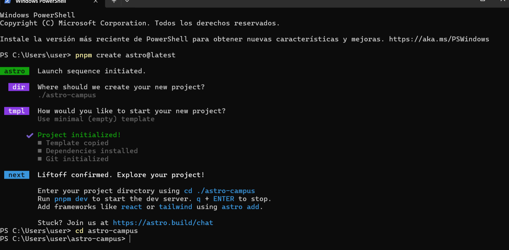
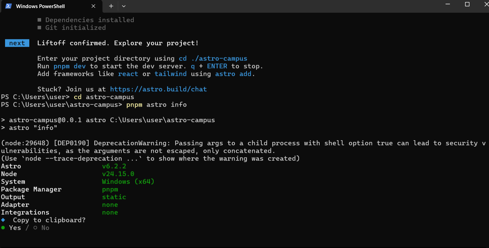
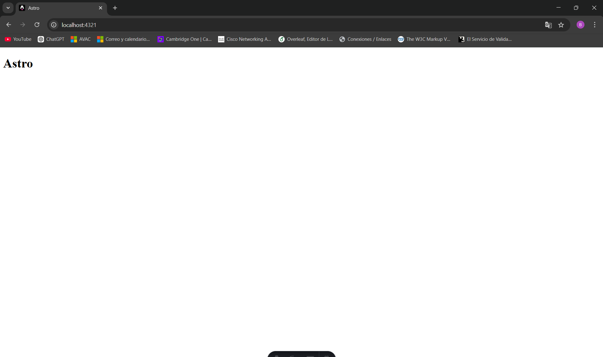
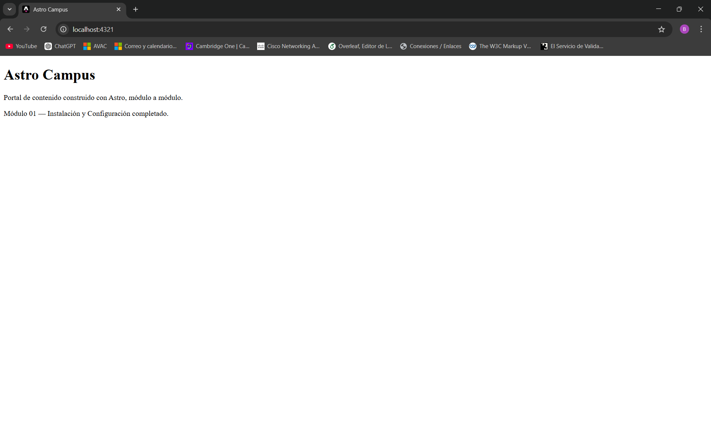

# Astro Campus

Este proyecto tiene como objetivo crear un portal de contenido donde eventualmente se construira progresivamente. Cada módula se complementa con el siguiente, sin romper con los anteriores.

## Capturas

### I. Proceso de creación del proyecto

### II. Salida de pnpm astro info

### III. Sitio ejecutándose en localhost:4321

### IV. Salida de build de producción

## 02 fundamemntos-astro-practica

Captura de http://localhost:4321 con los cards renderizados

Captura de http://localhost:4321/about funcionando